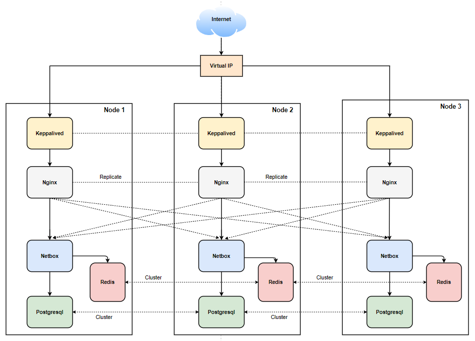

# Triển khai HA cho netbox sử dụng docker swarm

Repo này chứa các thành phần cần thiết để triển khai HA cho netbox sử dụng docker swarm. 


## Quickstart

Để bắt đầu thiết lập, trước tiên cần có 1 cụm docker swarm từ 3 node.

### Mô hình



### Chuẩn bị

- **Node 1(master node):**

IP: 10.10.35.191  
OS: Ubuntu 18.04  
Domain: netbox.com  
Hostname: node1  

- **Node 2(slave node):**

IP: 10.10.35.192  
OS: Ubuntu 18.04  
Domain: netbox.com  
Hostname: node2  

- **Node 3(slave node):**

IP: 10.10.35.193  
OS: Ubuntu 18.04  
Domain: netbox.com  
Hostname: node3  

- Virtual IP: 10.10.35.197

- User root hoặc user có quyền sudo  

Sau khi chuẩn bị môi trường, hãy tiến hành theo các bước sau: 

### Bước 1: Clone repo netbox HA:   

- Trên tất cả các node thực hiện clone repo: 

```
cd /opt
git clone https://github.com/hungviet99/Tim-hieu-Netbox.git
```

### Bước 2: Thêm config ip và domain cho netbox

- Thực hiện trên node master: 

```
cd /opt/Tim-hieu-Netbox/HA-Netbox-Docker
```
```
echo "ALLOWED_HOSTS=<DOMAIN_NAME> <IP_NODE_1>" >> /opt/Tim-hieu-Netbox/HA-Netbox-Docker/env/netbox.env
echo "ALLOWED_HOSTS=<DOMAIN_NAME> <IP_NODE_2>" >> /opt/Tim-hieu-Netbox/HA-Netbox-Docker/env/netbox1.env
echo "ALLOWED_HOSTS=<DOMAIN_NAME> <IP_NODE_3>" >> /opt/Tim-hieu-Netbox/HA-Netbox-Docker/env/netbox2.env
```

> Thay <DOMAIN_NAME> <IP_NODE_1,2,3> bằng tên domain dùng cho netbox và IP tương ứng của từng node. 

### Bước 3: Chỉnh cấu hình config domain cho nginx

- Thực hiện trên cả 3 node

```
sed -i 's/    server 10.10.35.191:8000 max_fails=3 fail_timeout=5s;/    server <IP_NODE_1>:8000 max_fails=3 fail_timeout=5s;/g' /opt/Tim-hieu-Netbox/HA-Netbox-Docker/nginx-cert/conf.d/default.conf
sed -i 's/    server 10.10.35.192:8001 max_fails=3 fail_timeout=5s;/    server <IP_NODE_2>:8001 max_fails=3 fail_timeout=5s;/g' /opt/Tim-hieu-Netbox/HA-Netbox-Docker/nginx-cert/conf.d/default.conf
sed -i 's/    server 10.10.35.193:8002 max_fails=3 fail_timeout=5s;/    server <IP_NODE_3>:8002 max_fails=3 fail_timeout=5s;/g' /opt/Tim-hieu-Netbox/HA-Netbox-Docker/nginx-cert/conf.d/default.conf
```

```
sed -i 's/    server_name netbox.com;/    server_name <DOMAIN_NAME>;/g' /opt/Tim-hieu-Netbox/HA-Netbox-Docker/nginx-cert/conf.d/default.conf
```

> Thay <DOMAIN_NAME> <IP_NODE_1,2,3> bằng tên domain dùng cho netbox và IP tương ứng của từng node. 

### Bước 4: Đặt lại cấu hình hostname

- Thực hiện trên node master

```
sed -i 's/node.hostname == node1/node.hostname == <HOSTNAME_NODE1>/g' /opt/Tim-hieu-Netbox/HA-Netbox-Docker/docker-compose.yml
sed -i 's/node.hostname == node2/node.hostname == <HOSTNAME_NODE2>/g' /opt/Tim-hieu-Netbox/HA-Netbox-Docker/docker-compose.yml
sed -i 's/node.hostname == node3/node.hostname == <HOSTNAME_NODE3>/g' /opt/Tim-hieu-Netbox/HA-Netbox-Docker/docker-compose.yml
```

> Sửa HOSTNAME_NODE1,2,3 tương ứng với hostname của các node. 

### Bước 5: Cài đặt netbox

```
tee docker-compose.override.yml <<EOF
version: '3.4'
services:
  netbox-node1:
    ports:
      - 8000:8080
  netbox-node2:
    ports:
      - 8001:8080
  netbox-node3:
    ports:
      - 8002:8080
EOF
docker stack deploy -c docker-compose.yml -c docker-compose.override.yml netbox
```

### Bước 6: Cài keppalived 

- Thực hiện trên cả 3 node:

Cấu hình cho phép gắn địa chỉ ip ảo lên card mạng và IP forward

```
echo "net.ipv4.ip_nonlocal_bind = 1" >> /etc/sysctl.conf
echo "net.ipv4.ip_forward = 1" >> /etc/sysctl.conf
sysctl -p
```

Tiếp theo ta sẽ cài đặt keepalived.

- Thực hiện trên node 1: 

```
docker run -d --name keepalived --restart always \
-e KEEPALIVED_PRIORITY=98 \
-e HOST_IP=10.10.35.191 \
-e KEEPALIVED_VIRTUAL_IP=10.10.35.197 \
-e KEEPALIVED_PASSWORD=Password \
--net=host --privileged=true angelnu/keepalived
```

- Thực hiện trên node 2:

```
docker run -d --name keepalived --restart always \
-e KEEPALIVED_PRIORITY=99 \
-e HOST_IP=10.10.35.192 \
-e KEEPALIVED_VIRTUAL_IP=10.10.35.197 \
-e KEEPALIVED_PASSWORD=Password \
--net=host --privileged=true angelnu/keepalived
```

- Thực hiện trên node 3:

```
docker run -d --name keepalived --restart always \
-e KEEPALIVED_PRIORITY=100 \
-e HOST_IP=10.10.35.193 \
-e KEEPALIVED_VIRTUAL_IP=10.10.35.197 \
-e KEEPALIVED_PASSWORD=Password \
--net=host --privileged=true angelnu/keepalived
```

> Lưu ý: `HOST_IP` sử dụng để khai báo ip tương ứng của từng node. `KEEPALIVED_VIRTUAL_IP` sử dụng để khai báo địa chỉ IP VIP, hãy chỉ định địa chỉ VIP theo địa chỉ của bạn. `Password` là keepalived pass, có thể sửa theo password mong muốn

### Bước 7: Kiểm tra 

Sau 1 vài phút toàn bộ ứng dụng được triển khai sẽ khả dụng. Mở trình duyệt và truy cập vào url `https://<DOMAIN_NAME_NETBOX>/` để vào trang chủ netbox. Có thể đăng nhập ở góc bên phải với thông tin đăng nhập mặc định là:

* Username: **admin**
* Password: **PasswordStrong@2021**
* API Token: **0123456789abcdef0123456789abcdef01234567**

## Dependencies

`Docker` và `docker-compose` phải đáp ứng các yêu cầu sau:

* Phiên bản thấp nhất của `Docker` là `19.03`.
* Phiên bản thấp nhất của `docker-compose` là `1.28.0`.

Để kiểm tra phiên bản đã cài đặt hãy làm như sau: `docker --version` và `docker-compose --version`.

## About

Reference from [Netbox Docker](https://github.com/netbox-community/netbox-docker)