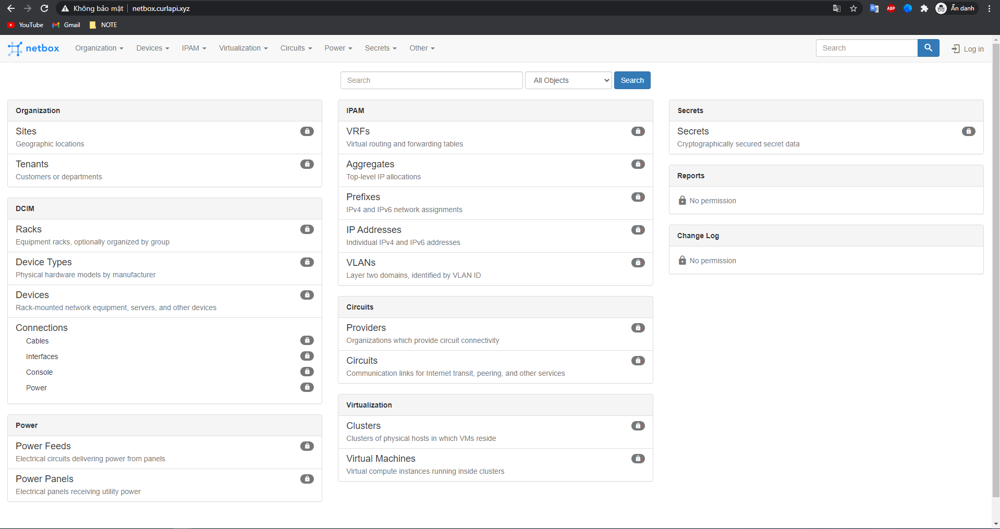

# Install HA Netbox

**Các phụ thuộc:**

- *Phiên bản thấp nhất của Docker là 19.03*

- *Phiên bản thấp nhất của docker-compose là 1.28.0*

## Mô tả hệ thống

### 1. Sơ đồ triển khai


### 2. Thông tin các node

*Đầu tiên, ta sẽ cần 1 cụm docker swarm gồm 3 node để có thể chạy. 1 node master và 2 node slave*

- **Node 1 (Master)**

IP: 10.10.35.194  
OS: Ubuntu 18.04  
Hostname: docker1

- **Node2 (Slave)**

IP: 10.10.35.195  
OS: Ubuntu 18.04  
Hostname: docker2  

- **Node3 (slave)**

IP: 10.10.35.196  
OS: Ubuntu 18.04  
Hostname: docker3

- Virtual IP: 10.10.35.197

- Domain: netbox.curlapi.xyz

- User root hoặc user có quyền sudo

## Cài đặt và cấu hình 

### Bước 1: Cấu hình căn bản: 

- Đặt hostname và tắt firewall cho các node: 

*node1:*

```
hostnamectl set-hostname docker1
systemctl disable ufw --now
```

*node2:*

```
hostnamectl set-hostname docker2
systemctl disable ufw --now
```

*node3:*

```
hostnamectl set-hostname docker3
systemctl disable ufw --now
```

### Bước 2: Cài đặt docker và docker compose

*Thực hiện trên tất cả các node*

- Cài đặt docker: 

```
apt update 
apt install docker.io -y
```

-  Cài đặt docker-compose: 

```
sudo curl -L "https://github.com/docker/compose/releases/download/1.28.5/docker-compose-$(uname -s)-$(uname -m)" -o /usr/local/bin/docker-compose

chmod +x /usr/local/bin/docker-compose
```

Sau đó kiểm tra lại với lệnh `docker-compose --version`:

```
root@docker1:~# docker-compose --version
docker-compose version 1.28.5, build c4eb3a1f
```

### Bước 3: Thiết lập cụm docker swarm 

*Thực hiện trên node 1*

```
docker swarm init --advertise-addr 10.10.35.194
```

Sau đó ta sẽ được hướng dẫn follow theo command sau: 

```
docker swarm join --token SWMTKN-1-06c9zk3d4zqa58cvoxsspay4e206akz80l5l8opmevdr505o5j-24vo33nz7s3xs1bbizrwndonm 10.10.35.194:2377
```

> Lưu ý: token trên chỉ app dụng được cho bài lab này!. Đối với lab khác thì token sẽ khác nhau. 

*Copy lệnh trên và thực hiện trên node 2 và 3*

```
root@docker2:~# docker swarm join --token SWMTKN-1-06c9zk3d4zqa58cvoxsspay4e206akz80l5l8opmevdr505o5j-24vo33nz7s3xs1bbizrwndonm 10.10.35.194:2377
This node joined a swarm as a worker.
```

```
root@docker3:~# docker swarm join --token SWMTKN-1-06c9zk3d4zqa58cvoxsspay4e206akz80l5l8opmevdr505o5j-24vo33nz7s3xs1bbizrwndonm 10.10.35.194:2377
This node joined a swarm as a worker.
```

### Bước 4: Clone repo netbox ha

*Thực hiện trên tất cả các node*

```
cd /opt
git clone https://github.com/hungviet99/Tim-hieu-Netbox.git
```

### Bước 5: Chỉnh cấu hình netbox để cho phép truy cập bằng domain

*Thực hiện trên node master*

```
cd /opt/Tim-hieu-Netbox/HA-Netbox-Docker
```

```
echo "ALLOWED_HOSTS=netbox.curlapi.xyz 10.10.35.194" >> /opt/Tim-hieu-Netbox/HA-Netbox-Docker/env/netbox.env
echo "ALLOWED_HOSTS=netbox.curlapi.xyz 10.10.35.195" >> /opt/Tim-hieu-Netbox/HA-Netbox-Docker/env/netbox1.env
echo "ALLOWED_HOSTS=netbox.curlapi.xyz 10.10.35.196" >> /opt/Tim-hieu-Netbox/HA-Netbox-Docker/env/netbox2.env
```

> Lưu ý: Thay `netbox.curlapi.xyz` và `10.10.35.194`, `10.10.35.195`, `10.10.35.196` thành domain và địa chỉ ip dùng cho các node của bạn. 

### Bước 6: Chỉnh cấu hình config domain cho nginx

*Thực hiện trên cả 3 node*

```
sed -i 's/    server 10.10.35.191:8000 max_fails=3 fail_timeout=5s;/    server 10.10.35.194:8000 max_fails=3 fail_timeout=5s;/g' /opt/Tim-hieu-Netbox/HA-Netbox-Docker/nginx-cert/conf.d/default.conf
sed -i 's/    server 10.10.35.192:8001 max_fails=3 fail_timeout=5s;/    server 10.10.35.195:8001 max_fails=3 fail_timeout=5s;/g' /opt/Tim-hieu-Netbox/HA-Netbox-Docker/nginx-cert/conf.d/default.conf
sed -i 's/    server 10.10.35.193:8002 max_fails=3 fail_timeout=5s;/    server 10.10.35.196:8002 max_fails=3 fail_timeout=5s;/g' /opt/Tim-hieu-Netbox/HA-Netbox-Docker/nginx-cert/conf.d/default.conf
```

> Lưu ý: thay địa chỉ `10.10.35.194`, `10.10.35.195`, `10.10.35.196` thành địa chỉ ip dùng cho các node của bạn. 

```
sed -i 's/    server_name netbox.com;/    server_name netbox.curlapi.xyz;/g' /opt/Tim-hieu-Netbox/HA-Netbox-Docker/nginx-cert/conf.d/default.conf
```

> Thay domain `netbox.curlapi.xyz` thành domain name của bạn. 


### Bước 7: Đặt lại hostname cho các service 

*Thực hiện trên node master*

```
sed -i 's/node.hostname == node1/node.hostname == docker1/g' /opt/Tim-hieu-Netbox/HA-Netbox-Docker/docker-compose.yml
sed -i 's/node.hostname == node2/node.hostname == docker2/g' /opt/Tim-hieu-Netbox/HA-Netbox-Docker/docker-compose.yml
sed -i 's/node.hostname == node3/node.hostname == docker3/g' /opt/Tim-hieu-Netbox/HA-Netbox-Docker/docker-compose.yml
```

### Bước 8: Cài đặt netbox ha 

```
cd /opt/Tim-hieu-Netbox/HA-Netbox-Docker
tee docker-compose.override.yml <<EOF
version: '3.4'
services:
  netbox-node1:
    ports:
      - 8000:8080
  netbox-node2:
    ports:
      - 8001:8080
  netbox-node3:
    ports:
      - 8002:8080
EOF
docker stack deploy -c docker-compose.yml -c docker-compose.override.yml netbox
```

- Kiểm tra lại các service 

```
root@docker1:~# docker service ls
ID             NAME                                MODE         REPLICAS   IMAGE                          PORTS
s8tbpcg1okt5   netbox_netbox-node1                 replicated   1/1        netboxcommunity/netbox:v2.10   *:8000->8080/tcp, *:30028->8080/tcp
zabtha682t5r   netbox_netbox-node2                 replicated   1/1        netboxcommunity/netbox:v2.10   *:8001->8080/tcp, *:30033->8080/tcp
4xqbas6kegni   netbox_netbox-node3                 replicated   1/1        netboxcommunity/netbox:v2.10   *:8002->8080/tcp, *:30029->8080/tcp
gc2sbcpc8975   netbox_netbox-wk-node1              replicated   1/1        netboxcommunity/netbox:v2.10
txljhrc5ogus   netbox_netbox-wk-node2              replicated   1/1        netboxcommunity/netbox:v2.10
7v6dcmcgaylb   netbox_netbox-wk-node3              replicated   1/1        netboxcommunity/netbox:v2.10
0fg9g7mfthgg   netbox_nginx-reverse-lb             global       3/3        nginx:1.20                     *:80->80/tcp, *:443->443/tcp
in5anc74t6jg   netbox_pg-0                         replicated   1/1        bitnami/postgresql-repmgr:13   *:5435->5432/tcp
n7ix9m3u54z7   netbox_pg-1                         replicated   1/1        bitnami/postgresql-repmgr:13   *:5436->5432/tcp
xj2jiv3r80w7   netbox_pg-2                         replicated   1/1        bitnami/postgresql-repmgr:13   *:5437->5432/tcp
7nex7gagmabz   netbox_pgpool-0                     replicated   1/1        bitnami/pgpool:4               *:5432->5432/tcp
tw3h3pbct9oy   netbox_pgpool-1                     replicated   1/1        bitnami/pgpool:4               *:5433->5432/tcp
tg8wy6ewcpwj   netbox_pgpool-2                     replicated   1/1        bitnami/pgpool:4               *:5434->5432/tcp
nci1mdd810nh   netbox_redis-cache-node1            replicated   1/1        bitnami/redis:6.2
us8wecysbmhq   netbox_redis-cache-node2            replicated   1/1        bitnami/redis:6.2              *:30032->6379/tcp
zhl5jwlvdvuh   netbox_redis-cache-node3            replicated   1/1        bitnami/redis:6.2              *:30030->6379/tcp
k7s40q3tvtxi   netbox_redis-node1                  replicated   1/1        bitnami/redis:6.2
uc7hjghf6s9v   netbox_redis-node2                  replicated   1/1        bitnami/redis:6.2              *:30031->6379/tcp
s01zt36y3z9w   netbox_redis-node3                  replicated   1/1        bitnami/redis:6.2              *:30034->6379/tcp
zd944w4cou4m   netbox_redis-sentinel-cache-node1   replicated   1/1        bitnami/redis-sentinel:6.2     *:26382->26379/tcp
d6kqrl8ehzxb   netbox_redis-sentinel-cache-node2   replicated   1/1        bitnami/redis-sentinel:6.2     *:26383->26379/tcp
o5nk6h8qeqea   netbox_redis-sentinel-cache-node3   replicated   1/1        bitnami/redis-sentinel:6.2     *:26384->26379/tcp
isru42avxfpw   netbox_redis-sentinel-node1         replicated   1/1        bitnami/redis-sentinel:6.2     *:26379->26379/tcp
uz46ycj4t30j   netbox_redis-sentinel-node2         replicated   1/1        bitnami/redis-sentinel:6.2     *:26380->26379/tcp
spra2r5s3dao   netbox_redis-sentinel-node3         replicated   1/1        bitnami/redis-sentinel:6.2     *:26381->26379/tcp
```

Sau khi các service đã lên hết, tiến hành cài đặt keepalived.

### Bước 9: Cài đặt keepalived

- Cấu hình cho phép gắn địa chỉ ip ảo lên card mạng

*Thực hiện trên 3 node*

```
echo "net.ipv4.ip_nonlocal_bind = 1" >> /etc/sysctl.conf
echo "net.ipv4.ip_forward = 1" >> /etc/sysctl.conf
sysctl -p
```

- Cài đặt keepalived: 

*Thực hiện trên node 1*

```
docker run -d --name keepalived --restart always \
-e KEEPALIVED_PRIORITY=98 \
-e HOST_IP=10.10.35.194 \
-e KEEPALIVED_VIRTUAL_IP=10.10.35.197 \
-e KEEPALIVED_PASSWORD=Password \
--net=host --privileged=true angelnu/keepalived
```


*Thực hiện trên node 2*

```
docker run -d --name keepalived --restart always \
-e KEEPALIVED_PRIORITY=99 \
-e HOST_IP=10.10.35.195 \
-e KEEPALIVED_VIRTUAL_IP=10.10.35.197 \
-e KEEPALIVED_PASSWORD=Password \
--net=host --privileged=true angelnu/keepalived
```

*Thực hiện trên node 3* 

```
docker run -d --name keepalived --restart always \
-e KEEPALIVED_PRIORITY=100 \
-e HOST_IP=10.10.35.196 \
-e KEEPALIVED_VIRTUAL_IP=10.10.35.197 \
-e KEEPALIVED_PASSWORD=Password \
--net=host --privileged=true angelnu/keepalived
```

> Lưu ý: `HOST_IP` sử dụng để khai báo ip tương ứng của từng node. `KEEPALIVED_VIRTUAL_IP` sử dụng để khai báo địa chỉ IP VIP, hãy chỉ định địa chỉ VIP theo địa chỉ của bạn. `KEEPALIVED_PASSWORD` sử dụng để đặt pass cho keepalived. 

### Bước 10. Kiểm tra

Nếu sử dụng ip local như mình thì sẽ phải khai báo file hosts để có thể truy cập bằng domain vào trình duyệt. 

File hosts trên windows tại: `C:\Windows\System32\Drivers\etc\hosts` 

File hosts trên linux tại: `etc/hosts`

Thêm đoạn sau vào cuối file `hosts`: 

```
10.10.35.197 netbox.curlapi.xyz
```

Sau đó có thể truy cập trình duyệt với url `https://netbox.curlapi.xyz`. 



Có thể đăng nhập vào netbox với thông tin đăng nhập mặc định là: 

- Username: **admin**
- Password: **PasswordStrong@2021**


